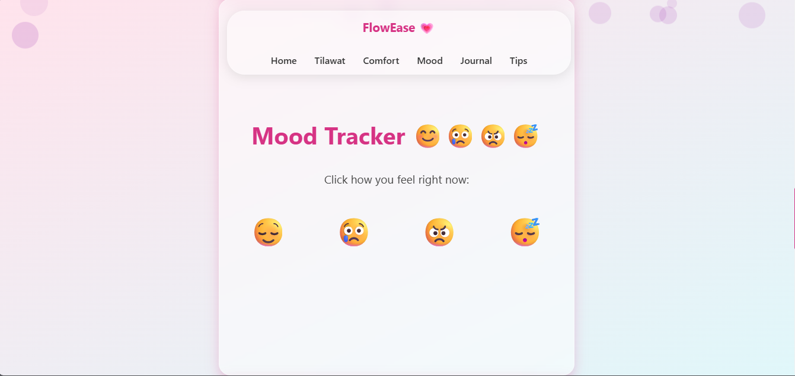

# 🌐 My Portfolio — Pakiza Nasir

<p align="center">
  
  
  
  
</p>

<p align="center">
  <strong>A personal portfolio website showcasing my skills, projects, and development journey.</strong>
</p>

<p align="center">
  <a href="https://github.com/Pakiza-Nasir/My-Portfolio">
    
  </a>
</p>

---

## 👩‍💻 About Me

Hi! I'm **Pakiza Nasir**, a developer passionate about learning, building, and turning ideas into practical projects.

I enjoy exploring programming and web development while continuously improving my skills through hands-on projects. Rather than only learning concepts theoretically, I like applying them to real projects and gradually making them better.

This portfolio represents my journey, skills, and the projects I've built along the way.

> 💡 **Learn → Build → Improve → Repeat**

---

## ✨ Portfolio Highlights

* 🎨 Clean and modern design
* 📱 Responsive layout
* 💻 Frontend-focused development
* 🛠️ Interactive elements using JavaScript
* 📂 Project showcase
* 📄 CV section
* 🔗 Social and professional links
* 📬 Contact section

---

## 🖥️ Portfolio Preview

<p align="center">
  
</p>

> 📌 **Tip:** Replace `image1.png` above with the screenshot that best represents your portfolio homepage.

---

## 🛠️ Skills & Technologies

### 💻 Development

<p>
  
  
  
  
</p>

### 🔧 Tools & Platforms

<p>
  
  
  
</p>

---

## 🚀 Featured Projects

Here are some of the projects I've worked on and included in my development journey.

### 🎮 Hangman Game

A simple text-based Hangman game built with Python.

**Highlights:**

* Random word selection
* Letter-by-letter guessing
* Limited incorrect attempts
* ASCII hangman visualization
* Separate correct and incorrect guesses
* Console-based gameplay

**Built with:** `Python`

🔗 **Repository:**
[View Hangman Project](https://github.com/Pakiza-Nasir)

---

### 🤖 Simple Chatbot

A beginner-friendly rule-based chatbot created with Python.

**Highlights:**

* User input handling
* Predefined responses
* `if / elif` logic
* Functions
* Interactive command-line experience

**Built with:** `Python`

🔗 **Repository:**
[View Chatbot Project](https://github.com/Pakiza-Nasir)

---

### 🌐 Personal Portfolio

This portfolio website itself is one of my projects and serves as a central place to showcase my skills and work.

**Built with:** `HTML` `CSS` `JavaScript`

🔗 **Repository:**
[View Portfolio Repository](https://github.com/Pakiza-Nasir/My-Portfolio)

---

## 📂 Project Structure

```text
My-Portfolio/
│
├── index.html
├── style.css
├── script.js
│
├── image1.png
├── image2.png
├── image3.png
├── image4.png
├── image5.png
├── image6.png
│
├── Pakiza_Nasir_CV.pdf
└── README.md
```

---

## 🚀 Run Locally

Want to explore or modify the portfolio locally?

### 1. Clone the repository

```bash
git clone https://github.com/Pakiza-Nasir/My-Portfolio.git
```

### 2. Open the project

```bash
cd My-Portfolio
```

### 3. Run the website

Open `index.html` directly in your browser.

For development, you can also open the project in **VS Code** and use the **Live Server** extension.

---

## 🎯 Goals

This portfolio is more than just a website. It is a place where I can document my progress and showcase what I am learning and building.

My current goals include:

* 📚 Strengthening my programming fundamentals
* 🌐 Improving frontend development skills
* 🐍 Building more Python projects
* 💡 Turning ideas into practical applications
* 🚀 Creating more real-world projects
* 📈 Continuously improving my development workflow

---

## 🔮 Future Improvements

I'm planning to keep evolving this portfolio as my skills grow.

Some future improvements may include:

* ✨ More advanced animations
* 📱 Further responsive design improvements
* 🧩 More interactive JavaScript features
* 📂 Additional projects
* 🎨 UI/UX improvements
* ⚡ Performance optimization
* ♿ Accessibility improvements

---

## 📄 CV

My CV is available inside this repository.

📎 **[View CV](./Pakiza_Nasir_CV.pdf)**

---

## 🤝 Let's Connect

I'm always interested in learning, building, and connecting with other developers.

<p>
  <a href="https://github.com/Pakiza-Nasir">
    
  </a>
</p>

---

## ⭐ Show Your Support

If you like this portfolio or find any of my projects interesting, consider giving the repository a ⭐.

Every bit of support motivates me to keep learning and building!

---

<p align="center">
  <strong>Built with ❤️ by Pakiza Nasir</strong>
</p>

<p align="center">
  <i>Learning. Building. Improving.</i>
</p>
