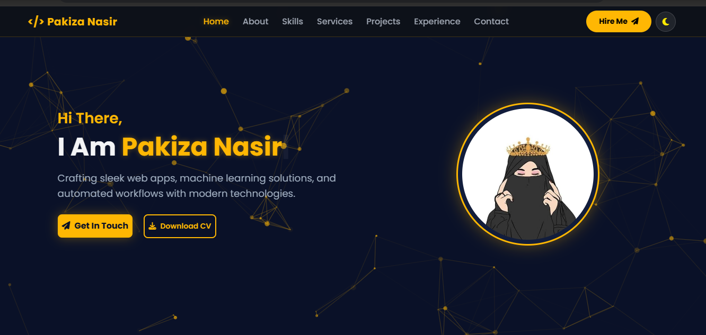

//# 🌐 Pakiza Nasir — Personal Portfolio

<p align="center">
  
  
  
  
  
</p>

<p align="center">
  <strong>Personal portfolio showcasing my skills, projects, experience, and development journey.</strong>
</p>

<p align="center">
  <a href="https://github.com/Pakiza-Nasir/My-Portfolio">
    
  </a>
</p>

---

## 👩‍💻 About Me

Hi, I'm **Pakiza Nasir**, a Computer Science graduate passionate about building modern web applications, exploring machine learning, and creating practical digital solutions.

I enjoy turning ideas into real projects while continuously improving my technical and problem-solving skills. My interests span across **frontend development, Python, machine learning, automation, and project management**.

I believe in learning through hands-on experience — building projects, experimenting with technologies, and continuously improving along the way.

> **Learn. Build. Improve. Repeat. 🚀**

---

## 🖥️ Portfolio Preview

<p align="center">

</p>

---

## 🛠️ Skills & Technologies

### 💻 Frontend

<p>
  
  
  
  
  
</p>

### 🐍 Backend & Programming

<p>
  
  
  
  
  
</p>

### 🗄️ Database & Tools

<p>
  
  
  
  
  
  
</p>

---

# 🚀 Featured Projects

A selection of web applications and machine learning projects featured in my portfolio.

---

### 🌦️ Real-Time Weather App

A responsive weather application for checking real-time weather information by city.

**Tech:** `HTML` `CSS` `JavaScript`

🔗 [View Project](https://github.com/Pakiza-Nasir/weather-app)

---

### 🩺 Diabetes Prediction System

A machine learning-based application for diabetes risk prediction.

**Tech:** `Python` `Django` `Machine Learning`

🔗 [View Project](https://github.com/Pakiza-Nasir/Diabetes-Prediction-System)

---

### 📩 SMS Classifier System

A machine learning and NLP project for detecting spam messages.

**Tech:** `Python` `NLP` `Scikit-Learn`

🔗 [View Project](https://github.com/Pakiza-Nasir/SMS-Spam-Detection)

---

### 🌸 FlowEase — Period Companion

A supportive web application focused on period self-care and interactive user experiences.

**Tech:** `HTML` `CSS` `JavaScript`

🔗 [View Project](https://github.com/Pakiza-Nasir/FlowEase)

---

### 🧮 Interactive Modern Calculator

A modern calculator with interactive functionality and a clean user interface.

**Tech:** `HTML` `CSS` `JavaScript`

🔗 [View Project](https://github.com/Pakiza-Nasir/Calculator_CodeAlpha)

---

### 🖼️ Interactive Image Gallery

A responsive image gallery with filtering, hover effects, and interactive viewing.

**Tech:** `HTML` `CSS` `JavaScript`

🔗 [View Project](https://github.com/Pakiza-Nasir/CodeAlpha_ImageGallery)

---

## 📊 Portfolio Highlights

| 🎯 Category | Details |
|---|---|
| 🎓 Education | BS Computer Science |
| 💼 Experience | 1+ Year Hands-on Experience |
| 🚀 Projects | 6+ Projects |
| 💻 Tech Skills | 15+ Technologies & Tools |
| 🌐 Focus | Web Development & Machine Learning |
| 📋 Methodology | Agile / Scrum |

---

## 🧩 Services & Expertise

### 💻 Front-End Web Development
Building responsive and modern web interfaces using HTML, CSS, JavaScript, React, and Bootstrap.

### 🧠 Machine Learning
Working with Python, Django, machine learning models, and data-driven applications.

### 📋 Project Management
Experience with Agile/Scrum practices, project workflows, task tracking, and automation tools.

---

## 📂 Project Structure

```text
My-Portfolio/
│
├── index.html
├── style.css
├── script.js
│
├── image1.png
├── image2.png
├── image3.png
├── image4.png
├── image5.png
├── image6.png
│
├── Pakiza_Nasir_CV.pdf
└── README.md
